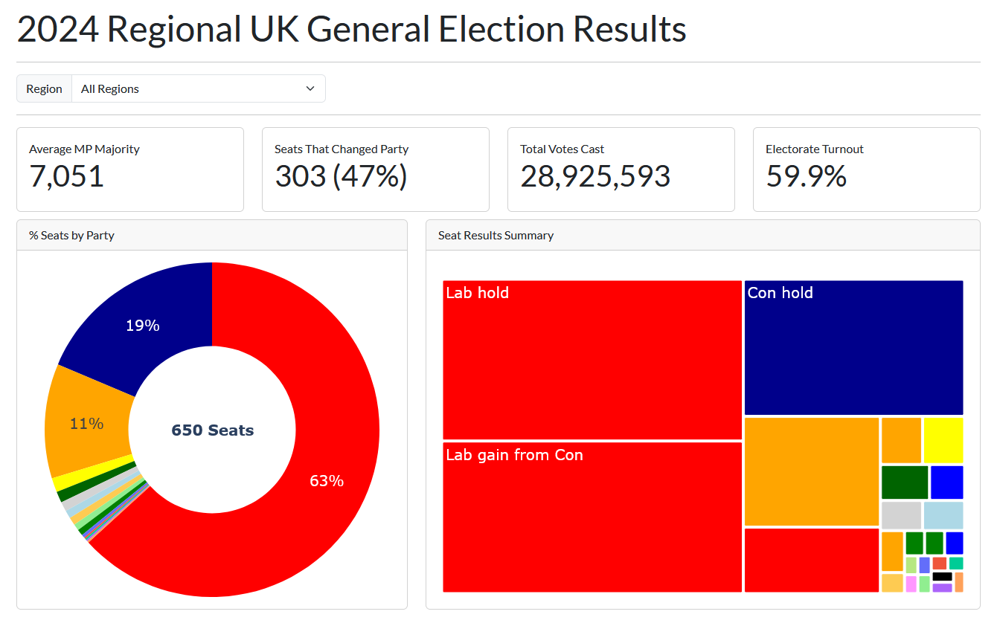

# 2024 Regional UK General Election Results

What were the regional results of the UK general election? This application visualises the result of the United Kingdom's 2024 General Election result in terms of the geographic regions of the UK, e.g. Wales, East Midlands, Scotland. The electorate of the United Kingdom (i.e. people with the right to vote) cast ballots to elect a single candidate to become a Member of Parliament (MP) for each constitency (geographic areas of roughly equal population size). There are 650 constituencies in the United Kingdom, each constituency sends one winning candidate to take their seat in the legislative branch of the government, the UK Parliament.

This Plotly Dash dashboard is written in Python and displays the result of the latest General Election at the time of writing. Data for the dashboard comes from the [UK Parliament's website](https://electionresults.parliament.uk/).

### Features

- Average MP majority - the average difference in number of votes cast for the first place candidate and the second place candidate
- Seats that Changed Party - the total number of constituency seats that were previously held by an MP from a different political party
- Total Votes Case - the number of valid ballots that were counted in a selected region
- Electorate Turnout - the proportion of registered voters who cast a ballot in the election
- Donut visualisation - showing the percentage of constituency seat won by each political party
- Treemap visualisation - showing the proportion of seats that were held or gained by each political party

### Key Dependencies
- Plotly Dash
- Pandas

### Screenshot

